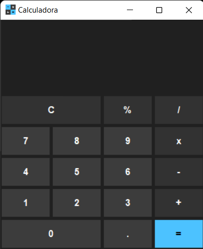
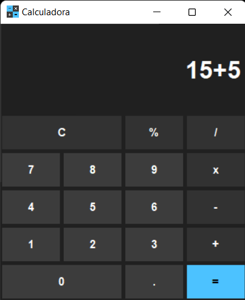

# Calculadora Python

    <!--  -->
    
    

Calculadora simples em Python com interface gráfica.

## :hammer: Funcionalidades do projeto
- `Calculadora simples`: calculadora simples para cálculos de soma, subtração, divisão e multiplicação.
- `Função de memória`: para armazenar valores na memória.

 

## :file_folder: Acesso ao projeto
Você pode [acessar o código-fonte do projeto](https://github.com/GabrielSchiavo/calculadora-python) ou [baixá-lo](https://github.com/GabrielSchiavo/calculadora-python/archive/refs/heads/main.zip).

## 	:hammer_and_wrench: Abrir e rodar o projeto
Após baixar o projeto, você pode abrir com o Visual Studio Code. Para o projeto funcionar você deve ter configurado no seu PC:

* Python >= 3.10.5

Agora, dentro da pasta do projeto abra um terminal e execute:

* python calculadora.py

Agora o projeto está pronto para ser utilizado.

## :heavy_check_mark: Tecnologias utilizadas
* `Python - 3.10.5`
* `Tkinter - 8.6`
